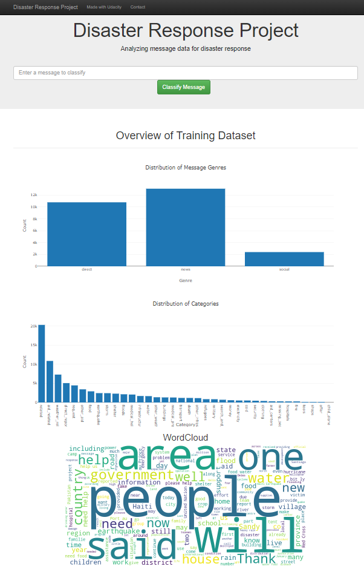

# Disaster Response Pipeline

### Introduction
This project uses a pre-labeled dataset of tweets and text messages from real-life disaster events, provided by Figure Eight. The goal is to clean and prepare this data through an ETL (Extract, Transform, Load) pipeline, followed by building a machine learning pipeline to develop a supervised NLP (Natural Language Processing) model. The model classifies each message into relevant categories, helping to identify different trends in disaster communication.

Beyond the ETL and machine learning pipelines, the project includes a web application where emergency workers can input new messages and receive instant classification results across several categories. The web app also features visualizations to provide further insights from the data, assisting emergency personnel in making timely and informed decisions

---
### Files in the Repository

- **data/**
  - `disaster_messages.csv`: Pre-labeled text messages and tweets from disaster events.
  - `disaster_categories.csv`: Corresponding categories for each message.
  - `process_data.py`: Script for the ETL pipeline (data cleaning and storage in SQLite).
  - `DisasterResponse.db`: SQLite database containing the cleaned dataset.

- **models/**
  - `train_classifier.py`: Script for the machine learning pipeline (NLP classification model).
  - `classifier.pkl`: Trained model saved as a pickle file.

- **app/**
  - static
    - `wordcloud.png`: Image of Word Cloud for message column in the training dataset
  - `run.py`: Flask app script for running the web application.
  - **templates/**
    - `master.html`: Main page template for the web app.
    - `go.html`: Results page template showing classifications and visualizations.

- **InsertDatabaseName.db**: sqlite database using to store data

---
### Instructions:
1. Run the following commands in the project's root directory to set up your database and model.

    - To run ETL pipeline that cleans data and stores in database
        ```
        python data/process_data.py data/disaster_messages.csv data/disaster_categories.csv data/DisasterResponse.db
        ```
    - To run ML pipeline that trains classifier and saves
        ```
        python models/train_classifier.py data/DisasterResponse.db models/classifier.pkl
        ```

2. Run the following command in the app's directory to run your web app.
    ```
    cd app
    python run.py
    ```

3. Go to http://0.0.0.0:3001/

---
### Home Screen of my Application
